!SLIDE
# Back to Basics, what is a metric?

* a bucket
* a value
* a timestamp, typically the UNIX epoch time
 

bucket.name  number  TIMESTAMP

 
 

&lt;stat_name&gt; &lt;number&gt; &lt;timestamp&gt; 

 

 

!SLIDE
# Metric Types for Collectd

* Gauges
* Derive 
* Counters
* Absolute

Gauges are the most commonly used metric type

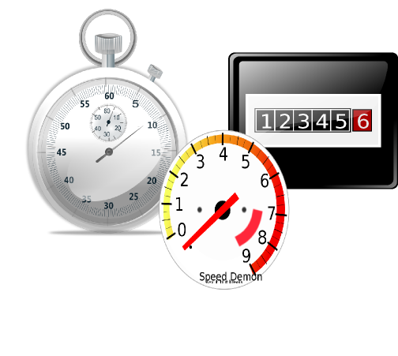

!SLIDE
# Metric Types for Statsd

* Gauges
* Counters*
* Timers
  
Counters* different than counters in collectd

!SLIDE
# Really Basic

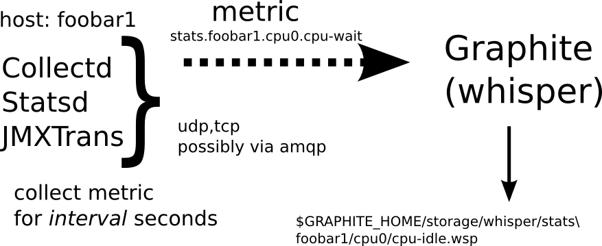

!SLIDE
# collectd in action

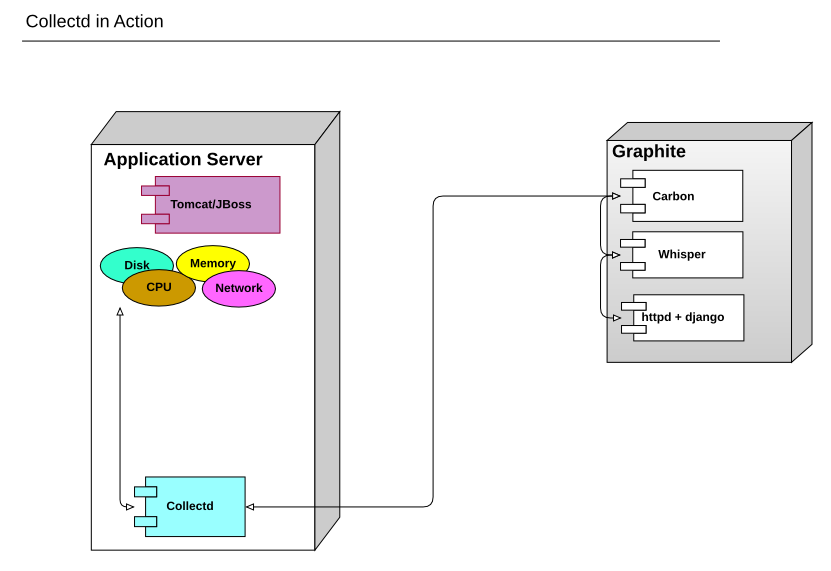

!SLIDE
# statsd in action 

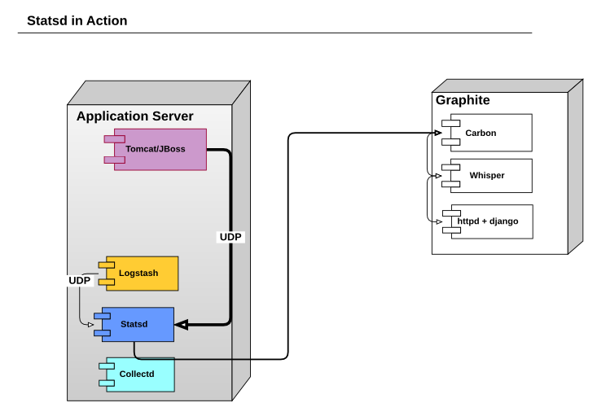

!SLIDE
# Gauges

A gauge simply indicates  
an arbitrary value at a point  
in time and is the  
simplest type in StatsD and collectd

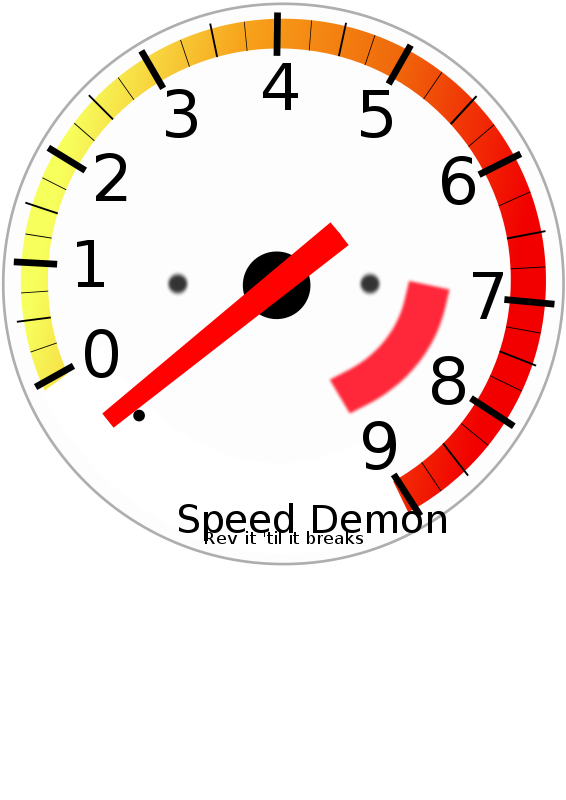</img>

.notes http://blog.pkhamre.com/2012/07/24/understanding-statsd-and-graphite/

!SLIDE
# Derive metric type (collectd only)

* Computes the delta of an underlying counter for a period of time
* Very useful for measuring network traffic

<math xmlns='http://www.w3.org/1998/Math/MathML'>
 value = <mfrac>
     <mrow>
         <msub><mi>value</mi><mn>new</mn></msub>
             <mo>-</mo>
         <msub><mi>value</mi><mn>old</mn></msub>
     </mrow>
     <mrow>
         <msub><mi>time</mi><mn>new</mn></msub>
             <mo>-</mo>
         <msub><mi>time</mi><mn>old</mn></msub>
     </mrow>
 </mfrac>
</math>

!SLIDE
# Counters (statsd)

* A counter adds a value to a bucket and stays in memory until the
  flush interval
* it sends two numbers for each bucket, a total count for the flush
  interval and a value per second
  
 

.notes http://blog.pkhamre.com/2012/07/24/understanding-statsd-and-graphite/

!SLIDE
# Statsd Timers

* Collect series of values
  * raw count
  * lower - minimum value for flush interval
  * mean
  * upper - maximum value for flush interval
  * 90th percentile, value at 90th percentile
  
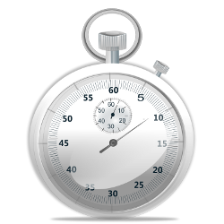

!SLIDE
# Let's take a look that JVM

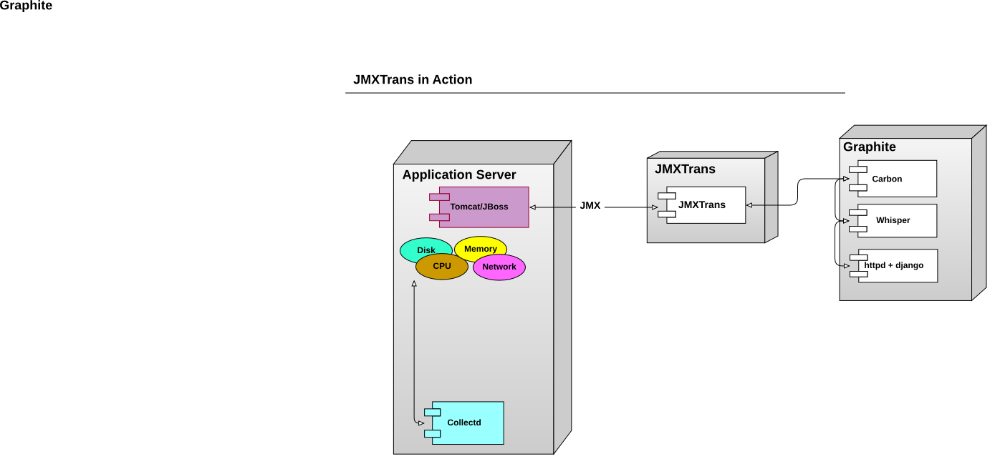

!SLIDE
# JMXtrans 

* JMXTrans polls each JVM each 60 seconds, by default
* As far as I can tell, values returned from a JMX query are Gauges

!SLIDE
# Let's look at that graph again

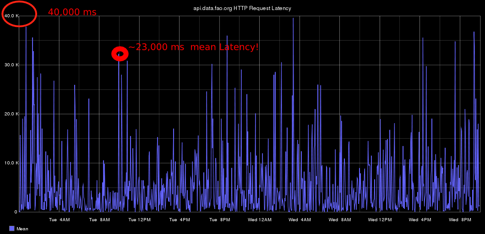</img>

That's horrible!

!SLIDE
# Means are Nasty, dirty things

* Let's look at that 90th Percentile

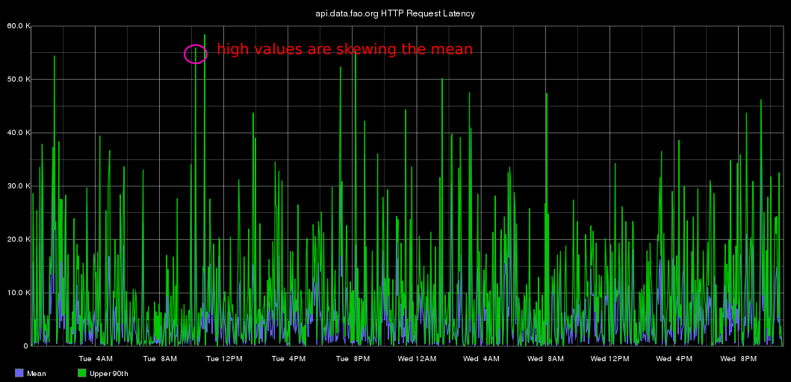</img>

!SLIDE
# Let's remove the 90th Percentile

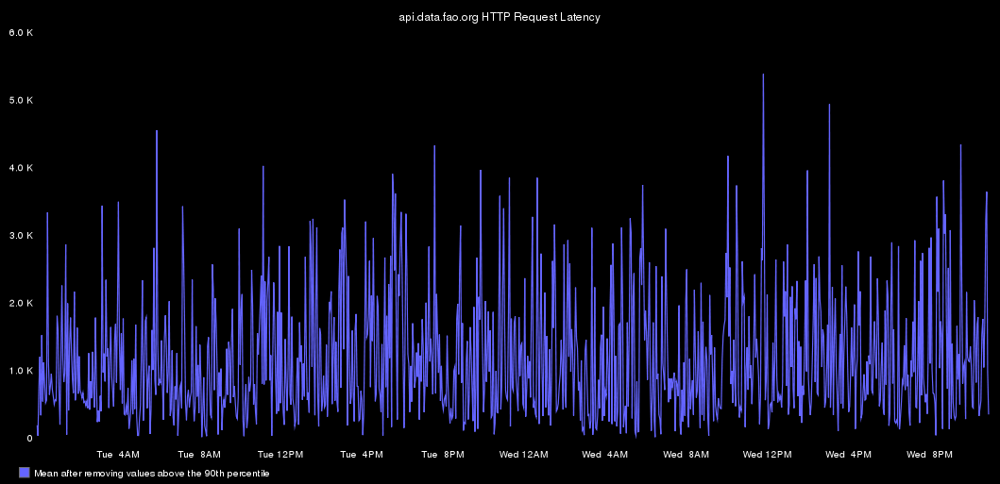</img>

!SLIDE
# learn it Love it

* removeAbovePercentile, along with other filtering functions, is
freaking awesome
* other filtering functions
  * removeAboveValue
  * removeBelowPercentile
  * removeBelowValue
  * mostDeviant
  
The average isn't all it's cracked up to be

* These functions are broken in Graphite 0.9.10 but fixed in master

!SLIDE
# Show me the worst!

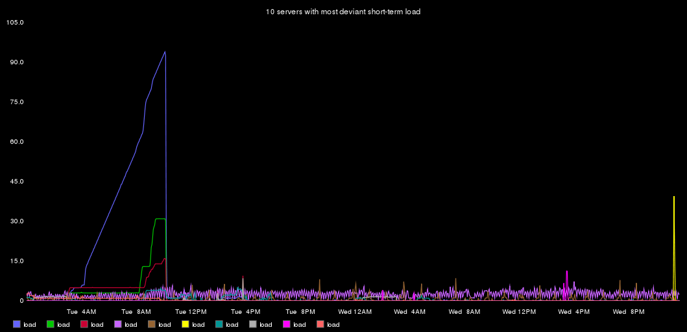</img>

!SLIDE
# Measure it

* Know your data
* Filter out distorting data
* Smooth the Savage Graph to reveal trends
* Maximize the power of Graphite

