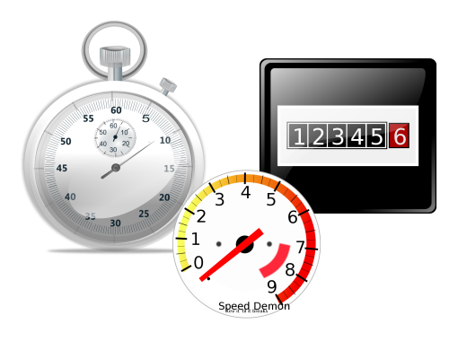

!SLIDE
# Back to Basics, what is a metric?

* a bucket
* a value
* a timestamp, typically the UNIX epoch time
 

bucket.name  number  TIMESTAMP

 
 

&lt;stat_name&gt; &lt;number&gt; &lt;timestamp&gt; 

 

 

!SLIDE
# Metric Types

* Gauges
* Counters
* Timers

!SLIDE
# Gauges

!SLIDE
# Counters

!SLIDE
# Timers

!SLIDE
# How Statsd does it

!SLIDE
# How Collectd does it

!SLIDE
# How JMX does it

!SLIDE
# Let's look at that graph again

explain request latency

