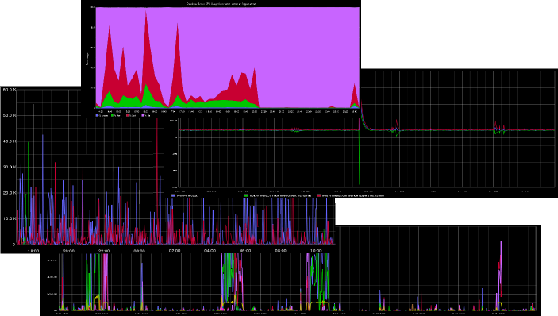
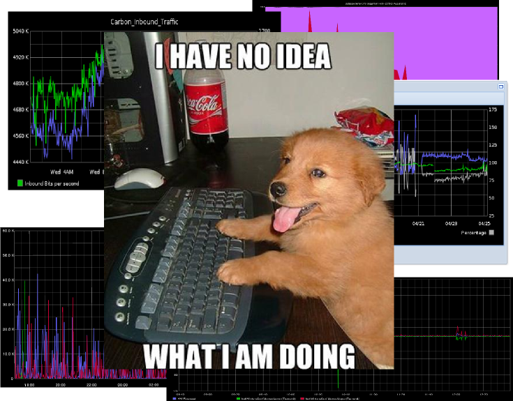

<!SLIDE center>

Measure it,  
Don't Just Monitor It

 
Devopsdays Italy 2012, Bryan W. Berry

!SLIDE
# Ohai There

* I work at [UN Food and Agriculture Organization](http://www.fao.org)
on the [http://data.fao.org](http://data.fao.org) project
* Creator and co-host of the
  [Food Fight podcast](http://foodfightshow.org)
* You can reach me at bryan.berry@gmail.com or @bryanwb
* I am a novice at statistics, graphs, and monitoring
  

</img> &nbsp; &nbsp;
</img>

!SLIDE
# more on data.fao.org

</img>

!SLIDE 
# Overview

* SOA is complicated
* Monitoring Helps
* But What does it all mean?
* Measure it, don't just monitor it
* Presentation matters

!SLIDE
# data.fao.org Architecture on Paper 

</img>

!SLIDE full-page

The Reality
 

.notes http://dummyatcooking.files.wordpress.com/2007/10/spaghetti-bolognese.jpg

!SLIDE
# What We use for Monitoring

* Collectd (cpu, disk, network, arbitrary system data)
* JMXtrans to poll JMX data
* Logstash + statsd awesome combination
* Graphite
* Elasticsearch + Kibana

largely based on discussion in [foodfightshow episode 21](http://foodfightshow.org/2012/07/monitoring-for-n00bs-with-jason-dixon.html)

!SLIDE 
# Here is what it looks like

</img>

!SLIDE
# Let There Be Graphs!

</img>

!SLIDE full-page

</img>

.notes http://www.buzzlol.com/wp-content/uploads/2012/05/Confused-Dog-Is-Confused.jpg

!SLIDE
# Do you know What this means?

</img>

Just collecting the data isn't enough

!SLIDE
# How fast/slow is the site?

* How many Requests per Second? Per minute?
* Are those thousands of seconds or thousands of milliseconds?
* What is the average request latency?
* Is "average" what we really want to know?

