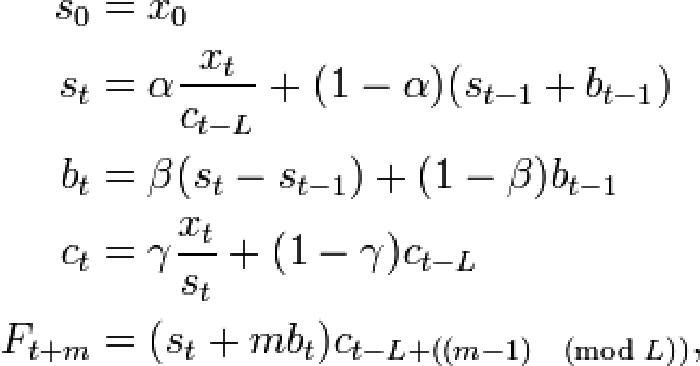

!SLIDE
# I see spikes, but no trend

!SLIDE 
# Smoothing 

Massage the Numbers to reveal the trend and to make useful forecasts

* Moving Average
* Moving Weighted Averages
* Holt-Winters

!SLIDE
# Let's Move that Average

!SLIDE
# Show me the Math!

For value M at time t and N number of points, calculate the average
based on the last 10 points   
<math xmlns='http://www.w3.org/1998/Math/MathML'>
<msub>M<mn>t</mn></msub> =
[ <msub>X<mn>t</mn></msub> + <msub>X<mn>t-1</mn></msub> + ... + <msub>X<mn>t-N+1</mn></msub>] / N
</math>

 
 

Moving Averages are OK at reflecting trend,   but  have no notion of
<em>seasonality</em>

!SLIDE
# Got Seasonality

!SLIDE
# Holt-Winters forecast

Let's Factor in:
* How smooth do we want the data to be, i.e. not spiky
* Trend
* Seasonality

!SLIDE
# Now with Seasoning

!SLIDE
# Show me the Math!

!SLIDE
# Oh no!

!SLIDE
# Confidence Bands

!SLIDE
# Alerting on HW

* Problems
* Immense Potential
* capacity planning

!SLIDE
# Let's Get Funky

Holt-winters aberration and a 2nd y-axis

!SLIDE
# How confident are you?

!SLIDE
# Presentation matters

* Maximize Data-ink Ratio
* Maximize data density
* Use _words_ and colors (to a lesser extent) to add context to your graph

!SLIDE
# Edward Tufte, Data Vis. Guru

image of Edward Tufte

"Graphics should do more than present the obvious to idiots"

!SLIDE
# More wisdom

"The task of the designer is to give visual access to the subtle and
the difficult -- that is, the revelation of the complex"

!SLIDE
# Drop Unnecessary Grid lines, Maximize Data-ink Ratio

!SLIDE
# Colors and Text can Illuminate

</img>

!SLIDE
# The underrated alias function

.notes any ink that doesn't convey information detracts from the info presented
.notes http://graphite.data.fao.org/render?_salt=1349170588.995&width=1433&height=584&from=14%3A00_20120821&until=23%3A59_20120821&areaMode=stacked&target=alias(collectd.hqlqatcdrdb1_hq_un_fao_org.cpu-0.cpu-system%2C%22%25%20System%22)&target=alias(collectd.hqlqatcdrdb1_hq_un_fao_org.cpu-0.cpu-user%2C%22%25%20User%22)&target=alias(collectd.hqlqatcdrdb1_hq_un_fao_org.cpu-0.cpu-wait%2C%22%25%20Wait%22)&target=alias(collectd.hqlqatcdrdb1_hq_un_fao_org.cpu-0.cpu-idle%2C%22%25%20Idle%22)&vtitle=Percentage&leftDashed=px&title=Database%20Server%20CPU%20Usage%20from%2014%3A00%20-%2023%3A59%2021%20August%202012

!SLIDE
# More Interesting Graphite Functions

* scale
* removeAbovePercentile
* cumulative
* hitCount
* . . . [and more](http://graphite.readthedocs.org/en/0.9.10/functions.html)!

!SLIDE
# John Rauser's wisdom on logs

!SLIDE
# The Power of Chef

cookbooks online and available

!SLIDE
# Questions?

Ask away

!SLIDE
# Further Resources

*  [Graphite Functions](http://graphite.readthedocs.org/en/0.9.10/functions.html)
*  [Holt-Winters Approach to Exponential Smoothing](http://faculty.wiu.edu/F-Dehkordi/DS-533/Lectures/Moving-average-methods.ppt)
by F. Dekhordi 
* [The Visual Display of Quantitative Information](http://www.edwardtufte.com/tufte/books_vdqi) by Edward Tufte
* [Pal Kristian Hamre's](http://blog.pkhamre.com) excellent blog
* [Jason Dixon](http://obfuscurity.com/) of course
* My Chef recipes for collectd, statsd, logstash, and jmxtrans
* Be sure to listen to the [FoodFightShow](http://foodfightshow.org) http://foodfightshow.org
   * [Monitoring for n00bs](http://traffic.libsyn.com/foodfight/ffs21_3.mp3)
   * [Monitoringsucks](http://traffic.libsyn.com/foodfight/ffs18_3.mp3)  

</img>

!SLIDE
# Special Thanks to

* Jason Dixon
* Pal Kristian Hamre
* Pete Fritchman
* Michael Leinartas

[This presentation](https://github.com/bryanwb/monitoring-measurement-preso) is available on github in showoff format
