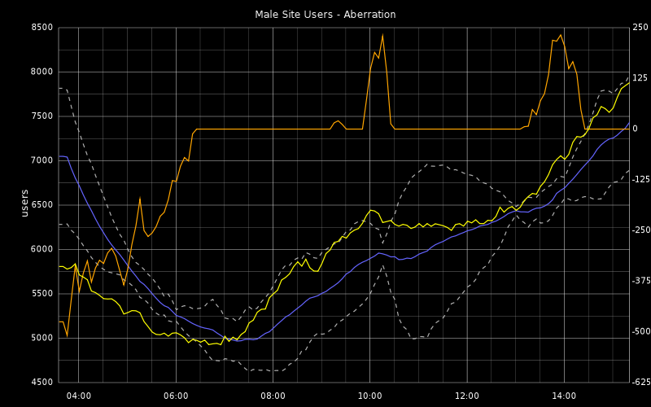

!SLIDE
# I see spikes, but no trend

!SLIDE 
# Smoothing 

Massage the Numbers to reveal the trend and to make useful forecasts

* Moving Average
* Moving Weighted Averages
* Holt-Winters

!SLIDE
# Let's Move that Average

erm, a little better

!SLIDE
# Show me the Math!

For value M at time t and N number of points, calculate the average
based on the last 10 points   
<math xmlns='http://www.w3.org/1998/Math/MathML'>
<msub>M<mn>t</mn></msub> =
[ <msub>X<mn>t</mn></msub> + <msub>X<mn>t-1</mn></msub> + ... + <msub>X<mn>t-N+1</mn></msub>] / N
</math>

 
 

Moving Averages are OK at reflecting trend,   but  have no notion of
<em>seasonality</em>

!SLIDE
# Got Seasonality?

.notes http://blog.pkhamre.com/2012/07/05/visualizing-logdata-with-logstash-statsd-and-graphite/

!SLIDE
# Holt-Winters forecast

Let's Factor in:

* How smooth do we want the data to be, i.e. not spiky
* Trend
* Seasonality

!SLIDE
# Now with Seasoning!

.notes http://blog.pkhamre.com/2012/07/05/visualizing-logdata-with-logstash-statsd-and-graphite/

!SLIDE
# Show me the Math!

!SLIDE
# Oh no!

!SLIDE
# Idiot's guide to Holt Winters

* 4 Equations
  * Overrall Smoothing
  * Trend Smoothing
  * Seasonal Smoothing
  * Actual Forecast
* 3 Constants
  * α - overrall
  * β - Trend
  * γ - Seasonality

.notes http://www.itl.nist.gov/div898/handbook/pmc/section4/pmc435.htm

!SLIDE
# Confidence Bands

.notes https://github.com/ripienaar/graphite-graph-dsl/wiki/Creating-Holt-Winters-Forecasts

!SLIDE
# Aberration

!SLIDE
# Great potential in Holt-Winters

* Intelligent capacity planning!
* More intelligent alerting
* Problems
  * Buggy implementation
  * Need to null outage data

!SLIDE
# Presentation matters

* Maximize Data-ink Ratio
* Maximize data density
* Use _words_ and colors (to a lesser extent) to add context to your graph

!SLIDE
# Edward Tufte, Data Visualization Guru

</img>

"Graphics should do more than present the obvious to idiots"

!SLIDE
# More wisdom

</img>

"The task of the designer is to give visual access to the subtle and
the difficult -- that is, the revelation of the complex"

!SLIDE
# Maximize Data-ink Ratio

Drop Unnecessary Grid lines 

</img>

Ah, much better!

!SLIDE
# Colors and Text can Illuminate

</img>

!SLIDE
# More Interesting Graphite Functions

* scale
* removeAbovePercentile
* cumulative
* summarize
* hitCount
* . . . [and many more!](http://graphite.readthedocs.org/en/0.9.10/functions.html)!

!SLIDE
# John Rauser - Look at Your Data

<iframe title="YouTube video player" width="640" height="410"
src="http://www.youtube.com/watch?v=coNDCIMH8bk" frameborder="0"
allowfullscreen>
</iframe>

!SLIDE
# The Power of Chef

* I couldn't have put together this stack w/out Chef
* cookbooks online and available
  * [collectd](https://github.com/bryanwb/chef-jmxtrans)
  * [graphite](https://github.com/bryanwb/chef-graphite)
  * [logstash](https://github.com/bryanwb/chef-logstash)
  * [ruby-statsd](https://github.com/bryanwb/chef-ruby-statsd)
* Checkout [monigusto](http://www.youtube.com/embed/oHg5SJYRHA0)!

!SLIDE
# Questions?

Ask away

!SLIDE
# Further Resources

*  [Graphite Functions](http://graphite.readthedocs.org/en/0.9.10/functions.html)
*  [Holt-Winters Approach to Exponential Smoothing](http://faculty.wiu.edu/F-Dehkordi/DS-533/Lectures/Moving-average-methods.ppt)
by F. Dekhordi 
* [The Visual Display of Quantitative Information](http://www.edwardtufte.com/tufte/books_vdqi) by Edward Tufte
* [Pal Kristian Hamre's](http://blog.pkhamre.com) excellent blog
* [Jason Dixon](http://obfuscurity.com/) of course
* My Chef recipes for collectd, statsd, logstash, and jmxtrans
* Be sure to listen to the [FoodFightShow](http://foodfightshow.org) http://foodfightshow.org
   * [Monitoring for n00bs](http://traffic.libsyn.com/foodfight/ffs21_3.mp3)
   * [Monitoringsucks](http://traffic.libsyn.com/foodfight/ffs18_3.mp3)  

</img>

!SLIDE
# Special Thanks to

* Jason Dixon
* Pal Kristian Hamre
* Pete Fritchman
* Michael Leinartas

[This presentation](https://github.com/bryanwb/monitoring-measurement-preso)
is available on github in showoff format, and diagrams done in SVG

Copyright 2012, Bryan W. Berry License: CC-By 3.0
