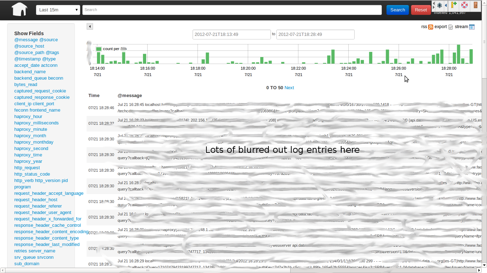
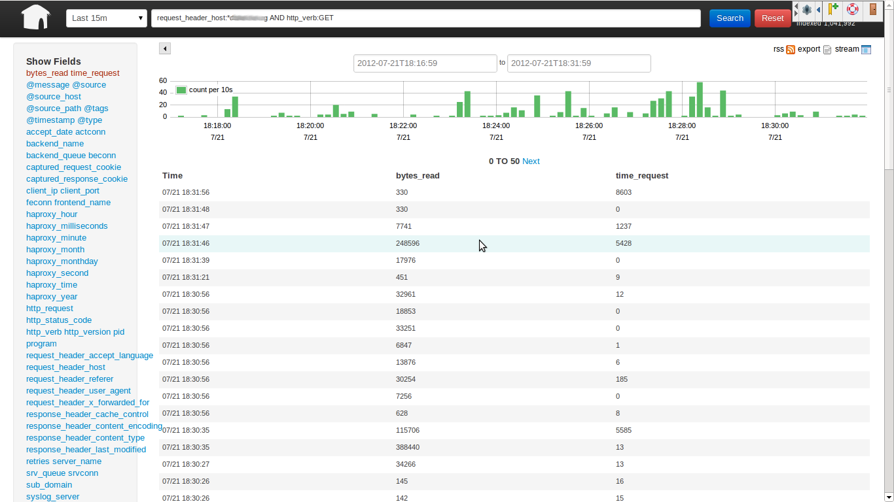
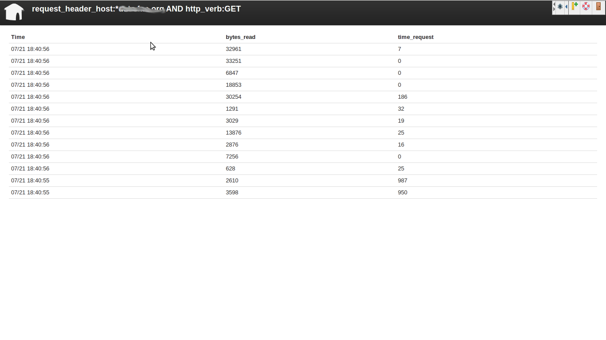
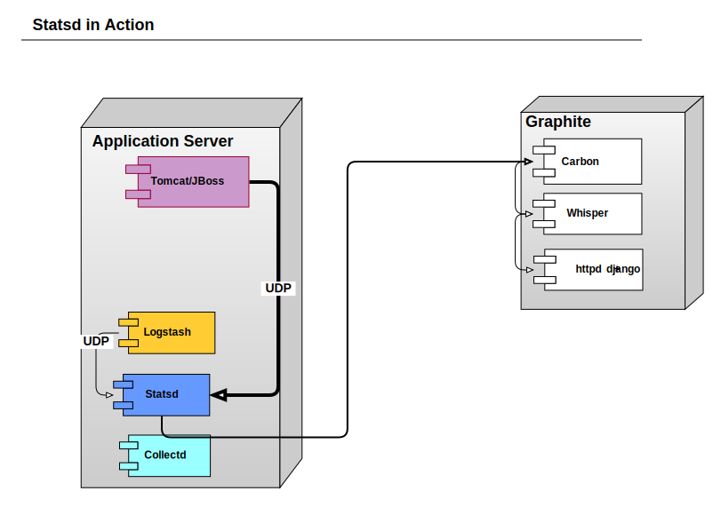
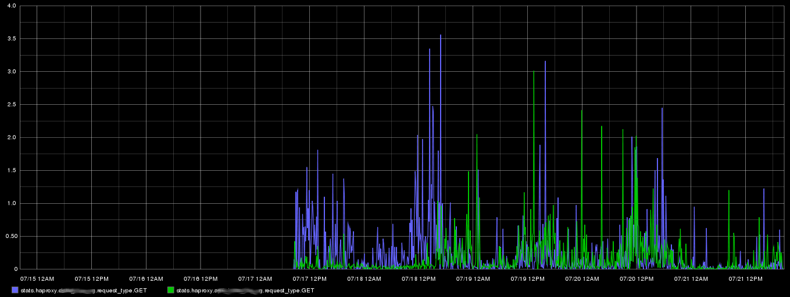

!SLIDE

 
 
 

Measure, Don't Just Monitor  

image of measure tap plus graph ?

.notes http://www.ironicsans.com/images/anewhope.png

!SLIDE
# Ohai!

I am Bryan W. Berry

* I am in charge of infrastructure operations for
[http://data.fao.org](http://data.fao.org), and I am the co-host of
the [FoodFightShow](http://foodfightshow.org) the bi-weekly Chef
community podcast
* [UN Food and Agriculture Organization](http://data.fao.org) is a UN
agency base here in Rome. 
image of FAO logo
 
You can reach me at bryan.berry@gmail.com

!SLIDE
# Overview

* SOA is complicated
* Monitoring Helps
* But What does it all mean?
* Measure it, don't just monitor it

!SLIDE
# data.fao.org Architecture on Paper 

show image of architecture

!SLIDE
# data.fao.org Architecture in Reality

systematic monitoring is critical to
untangling it
 

.notes http://dummyatcooking.files.wordpress.com/2007/10/spaghetti-bolognese.jpg

!SLIDE
# What We use for Monitoring

* Collectd (cpu, disk, network, arbitrary system data)
* JMXtrans to poll JMX data
* Logstash + statsd to gather stats from application logs
* Graphite
* Elasticsearch + Kibana

largely based on [foodfightshow episode 21](http://foodfightshow.org/2012/07/monitoring-for-n00bs-with-jason-dixon.html)

!SLIDE 
# Collectd for system metrics

</img>

!SLIDE
# Collectd is good

* lightweight C daemon
* monitors continuously, not once every 5 minutes
* Best for OS-level metrics such as CPU, Disk, Memory, etc. 

!SLIDE
# What's Graphite?

* Time Series Database (Whisper)
* Rendering Engine 
* Dashboard (Graphite-Web)
* data relay and aggregation (Carbon)
 

!SLIDE
# What is a metric?

* a name
* a value
* a timestamp, typically the UNIX epoch time
 

stats.haproxy.data_fao_org.request_duration  330  74857843

 
 

&lt;stat_name&gt; &lt;number&gt; &lt;timestamp&gt; 

 

 

!SLIDE
# JMXTrans

* Is just a connector for transporting JMX data
* No agent involved

!SLIDE
# What about those logs?

</img>

We don't only care about metrics, we also care about important
events   Scraping metrics from logs would be nice

!SLIDE
# Show me the graphic already!

!SLIDE
# Logstash can more than just ship logs

* Win
  * index by field
  * shape data
  * add new fields and tags to entries
  * Elasticsearch backend is awwwes0me

* Con - The agent is not light on resource usage

!SLIDE
# Logs don't have to be Ugly

!SLIDE
# We can filter the data

!SLIDE
# UNIX Tail in your browser

!SLIDE
# Elasticsearch Rocks

* We can use [Lucene Parser
  Syntax](https://lucene.apache.org/core/old_versioned_docs/versions/3_5_0/queryparsersyntax.html)
  to construct queries
* Watch out though, don't use quotes, the 1st example here works, the
  second doesn't
 

<em>> status_code:40* AND request_header_host:*fao_org</em>

 
 

<em>> status_code:"40*" AND request_header_host:"*fao_org"</em>

!SLIDE
# But this is not really enough

 
 

 Ideally, your application should be
instrumented from the inside
 
 
No one knows your code better than you

!SLIDE
# Use the Force, Luke

 
 
</img>
 
 

Use Statsd

.notes http://www.alexandgregory.com/images/luke%20skywalker.jpg

!SLIDE
# Show me a graphic     

!SLIDE
# Enter Statsd

* a small local daemon that your application send metrics to over UDP     
* has virtually no overhead
* I use [Pete Fritchman's Ruby implementation](https://github.com/fetep/ruby-statsd)
* Statsd ships the metrics it receives to graphite
* Types of metrics
  * gauges
  * timers
  * counters

!SLIDE
# So about the code

Here is some sample java code

!SLIDE
# Metrics, Metrics Everywhere

</img>
Coda Hale gave an [excellent talk](http://pivotallabs.com/talks/139-metrics-metrics-everywhere) about how his team at yammer
uses metrics
  
He also created an excellent [java library](http://metrics.codahale.com/) that you can use together
with statsd

!SLIDE
# Now, Graphite Demo

</img>

.notes show how to display request_duration across multiple sub_domains

!SLIDE

# You will get for free

* System-level monitoring with collectd
* JMX monitoring w/ JMXtrans
* log aggregation on request via logstash+elasticsearch+kibana
* All those data points in graphite

 

But if you are serious about
performance . . .

!SLIDE
# . . . You will

</img>

* instrument your code with the statsd java client or Coda
  Hale's metrics library
* Create custom graphs in graphite
* Solve performance problems the way real engineers do, with _data_

!SLIDE
# Questions?

Ask away

!SLIDE
# The Full Stack

!SLIDE
# Further Resources

* [Logstash](http://logstash.net)
* [Collectd](http://collectd.org)
* [statsd](https://github.com/etsy/statsd) and Pete Fritchman's [ruby-statsd](https://github.com/fetep/ruby-statsd)
* [graphite](http://graphite.wikidot.org)
* Coda Hale's [excellent talk](http://pivotallabs.com/talks/139-metrics-metrics-everywhere)
and library [java library](http://metrics.codahale.com/)
* Be sure to listen to the FoodFightShow! 
   * [Monitoring for n00bs](http://traffic.libsyn.com/foodfight/ffs21_3.mp3)
   * [Monitoringsucks](http://traffic.libsyn.com/foodfight/ffs18_3.mp3)  

</img>

