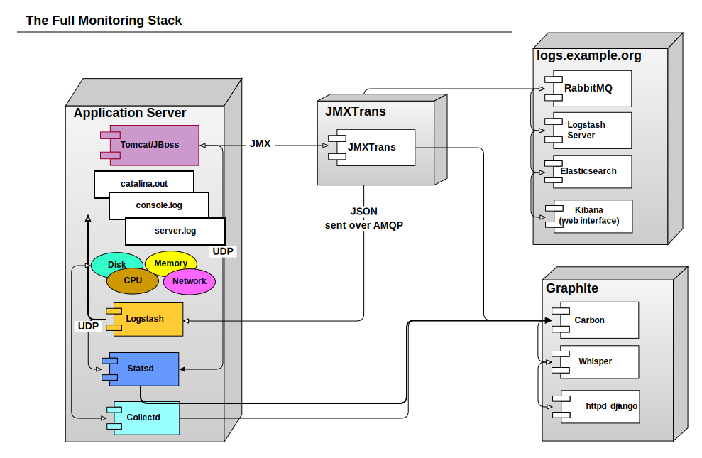
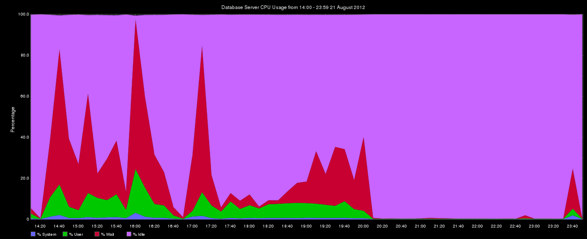

!SLIDE

 
 
 

Measure, Don't Just Monitor  

image of measure tap plus graph ?

.notes http://www.ironicsans.com/images/anewhope.png

!SLIDE
# Ohai!

I am Bryan W. Berry

* I am an operations consultant at the [UN Food and Agriculture Organization](http://www.fao.org) here in Rome. My principle responsibility is to manage infrastructure operations for
[http://data.fao.org](http://data.fao.org)
* Also the co-host of the [FoodFightShow](http://foodfightshow.org) the bi-weekly Chef
community podcast

image of FAO logo 
 
You can reach me at bryan.berry@gmail.com

!SLIDE
# Overview

* SOA is complicated
* Monitoring Helps
* But What does it all mean?
* Measure it, don't just monitor it
* 

!SLIDE
# data.fao.org Architecture on Paper 

show image of architecture

!SLIDE
# data.fao.org Architecture in Reality

systematic monitoring is critical to
untangling it
 

.notes http://dummyatcooking.files.wordpress.com/2007/10/spaghetti-bolognese.jpg

!SLIDE
# What We use for Monitoring

* Collectd (cpu, disk, network, arbitrary system data)
* JMXtrans to poll JMX data
* Logstash + statsd to gather stats from application logs
* Graphite
* Elasticsearch + Kibana

largely based on [foodfightshow episode 21](http://foodfightshow.org/2012/07/monitoring-for-n00bs-with-jason-dixon.html)

!SLIDE 
# Here is what it looks like

</img>

!SLIDE
# Let There Be Graphs!

!SLIDE
# But what does it all mean?

!SLIDE
# Do you know What this means?

!SLIDE
# How many Requests per second?

!SLIDE
# How slow is my site?

!SLIDE
# Back to Basics, what is a metric?

* a bucket name
* a value
* a timestamp, typically the UNIX epoch time
 

bucket.name  number  TIMESTAMP

 
 

&lt;stat_name&gt; &lt;number&gt; &lt;timestamp&gt; 

 

 

!SLIDE
# More complex values

* Gauges
* Counters
* Timers

!SLIDE
# Gauges

!SLIDE
# Counters

!SLIDE
# Timers

!SLIDE
# How Statsd does it

!SLIDE
# How Collectd does it

!SLIDE
# How JMX does it

!SLIDE
# Let's look at that graph again

explain request latency

!SLIDE
# Useful Operations

* Filter out or find distorting values
* Check performance after change 
* Smooth the Savage Graph

.notes distorying values MostDeviant, removeAbovePercentile
.notes timeshift
.notes  smoothing w/ moving averages, holt-winters

!SLIDE
# Let's See the Average disk latency

!SLIDE
# Compare it w/ last week

timeshift

!SLIDE 
# Let's look at request latency

esb

!SLIDE
# Filter out Worst cases

!SLIDE
# Show me the n worst cases!

!SLIDE
# What's the usage trend?

smoothing

moving averages

!SLIDE
# moving average

!SLIDE
# Holt-Winters forecast

!SLIDE
# Confidence Bands

!SLIDE
# Let's Get Funky

Holt-winters aberration and a 2nd y-axis

!SLIDE
# How confident are you?

!SLIDE
# Presentation matters

* Maximize Data-ink Ratio
* Maximize data density
* Use _words_ and colors (to a lesser extent) to add context to your graph

!SLIDE
# Edward Tufte, Data Vis. Guru

image of Edward Tufte

"Graphics should do more than present the obvious to idiots"

!SLIDE
# More wisdom

"The task of the designer is to give visual access to the subtle and
the difficult -- that is, the revelation of the complex"

!SLIDE
# Drop Unnecessary Grid lines, Maximize Data-ink Ratio

!SLIDE
# Colors and Text can Illuminate

</img>

!SLIDE
# The underrated alias function

.notes any ink that doesn't convey information detracts from the info presented
.notes http://graphite.data.fao.org/render?_salt=1349170588.995&width=1433&height=584&from=14%3A00_20120821&until=23%3A59_20120821&areaMode=stacked&target=alias(collectd.hqlqatcdrdb1_hq_un_fao_org.cpu-0.cpu-system%2C%22%25%20System%22)&target=alias(collectd.hqlqatcdrdb1_hq_un_fao_org.cpu-0.cpu-user%2C%22%25%20User%22)&target=alias(collectd.hqlqatcdrdb1_hq_un_fao_org.cpu-0.cpu-wait%2C%22%25%20Wait%22)&target=alias(collectd.hqlqatcdrdb1_hq_un_fao_org.cpu-0.cpu-idle%2C%22%25%20Idle%22)&vtitle=Percentage&leftDashed=px&title=Database%20Server%20CPU%20Usage%20from%2014%3A00%20-%2023%3A59%2021%20August%202012

!SLIDE
# More Interesting Graphite Functions

* scale
* removeAbovePercentile
* cumulative
* hitCount
* . . . [and more](http://graphite.readthedocs.org/en/0.9.10/functions.html)!

!SLIDE
# Questions?

Ask away

!SLIDE
# Further Resources

*  [Graphite Functions](http://graphite.readthedocs.org/en/0.9.10/functions.html)
*  [Holt-Winters Approach to Exponential Smoothing](http://faculty.wiu.edu/F-Dehkordi/DS-533/Lectures/Moving-average-methods.ppt)
by F. Dekhordi 
* [The Visual Display of Quantitative Information](http://www.edwardtufte.com/tufte/books_vdqi) by Edward Tufte
* [Pal Kristian Hamre's](http://blog.pkhamre.com) excellent blog
* [Jason Dixon](http://obfuscurity.com/) of course
* My Chef recipes for collectd, statsd, logstash, and jmxtrans
* Be sure to listen to the [FoodFightShow](http://foodfightshow.org) http://foodfightshow.org
   * [Monitoring for n00bs](http://traffic.libsyn.com/foodfight/ffs21_3.mp3)
   * [Monitoringsucks](http://traffic.libsyn.com/foodfight/ffs18_3.mp3)  

</img>

!SLIDE
# Special Thanks to

* Jason Dixon
* Pal Kristian Hamre
* Pete Fritchman
* Matt Leinartas

